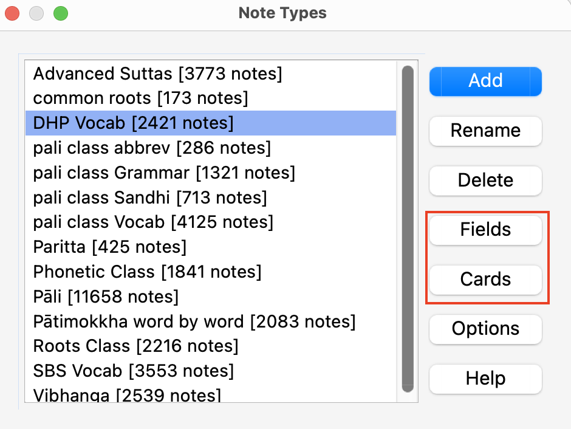
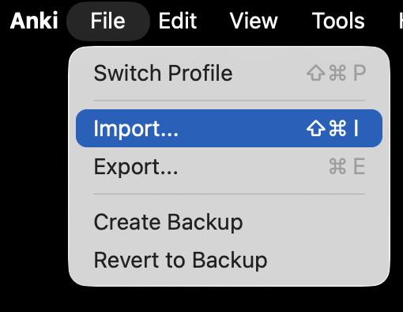
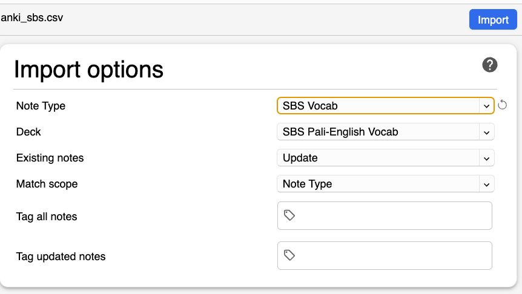

# Advanced: Updating with CSV

For users with very old versions of the deck or those who have trouble updating with the `.apkg` file, this method is more reliable but complex.

__! Important !__ Before updating, synchronize your collection across all devices. Go to **Tools > Preferences > Syncing** and enable "*On next sync force changes in one direction*". This creates a secure backup on AnkiWeb.

## Step 1: Download the CSV Files

Download the latest `.csv` file for your deck from the links below:

- [Vocab Pāli Class](https://github.com/sasanarakkha/study-tools/releases/latest/download/vocab-pali-class.csv)
- **Grammar Pāli Class** (Download all 3):
    - [note:pali class abbrev](https://github.com/sasanarakkha/study-tools/releases/latest/download/grammar-pali-class-abbr.csv)
    - [note:pali class Grammar](https://github.com/sasanarakkha/study-tools/releases/latest/download/grammar-pali-class-gramm.csv)
    - [note:pali class Sandhi](https://github.com/sasanarakkha/study-tools/releases/latest/download/grammar-pali-class-sandhi.csv)
- [Roots](https://github.com/sasanarakkha/study-tools/releases/latest/download/roots-pali-class.csv)
- [Phonetic Changes](https://github.com/sasanarakkha/study-tools/releases/latest/download/phonetic-pali-class.csv)
- [Common Roots](https://github.com/sasanarakkha/study-tools/releases/latest/download/common-roots.csv)

## Step 2: Verify Field Lists

Before importing, you must ensure your local field names exactly match the current versions. Go to **Tools > Manage Note Types** to verify.

Compare your current field list with the [most recent list](https://sasanarakkha.github.io/study-tools/5-anki/field-lists/) associated with the deck you’re updating.

## Step 3: Check Card Settings

Ensure your **Front Template**, **Back Template**, and **Styling** match the [latest versions](https://sasanarakkha.github.io/study-tools/5-anki/templates/).

Reference templates:
- [Vocab Styling and Templates](https://github.com/sasanarakkha/study-tools/anki-style)

## Step 4: Perform the Import

1. In Anki, go to **File > Import**.
   
2. Choose the downloaded `.csv` file.
3. Configure the import settings:
    - **Existing notes:** Update
    - **Match scope:** Note type
   
4. Double-check your settings and click **Import**.

After importing, don't forget to [remove outdated words](updating.md#removing-outdated-words).

---

Back to [Anki Decks Overview](index.md).
