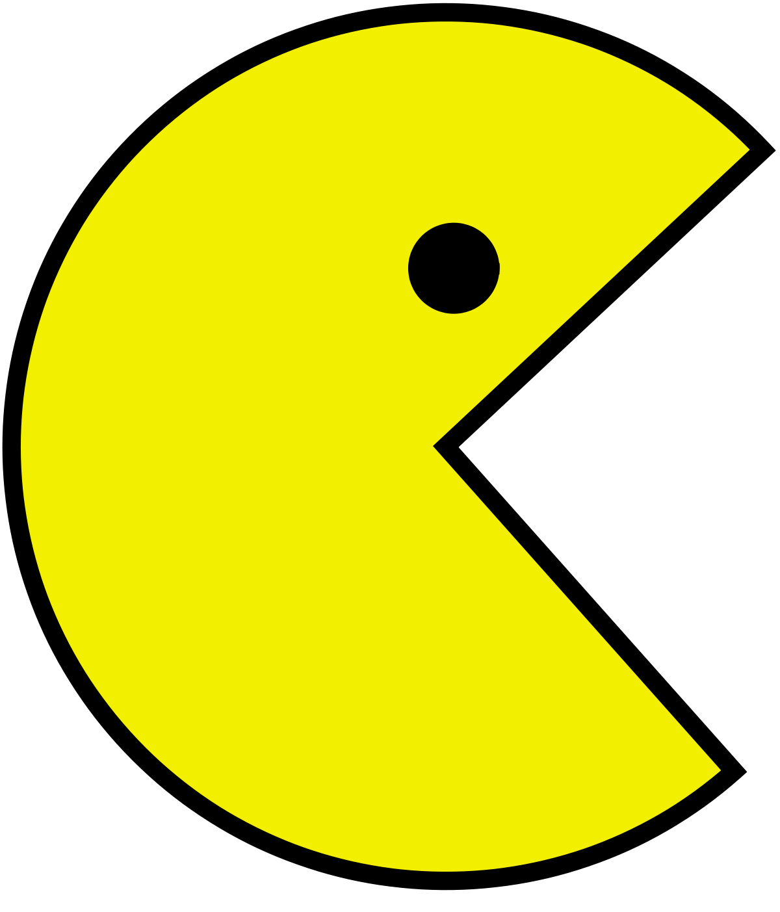

# Possibility \#4

When the second vowel is elided, the first vowel may be lengthened.

lokass**ai**ti **\>** lokass**ā**ti

**ai \> ā**

This means:

when a word ends in **a**,

and the next word starts with **i**,

the first **a** can be lengthened,

and the second **i** can be elided.

In Kaccāyana this is called (16) **pubbo ca.**

**ai \> ā**

|  |  |  |
| --- | --- | --- |
| itthattāy**a** | **i**ti | itthattāy**ā**ti |
| for such an existence | thus | for such an existence” |
| dukkhass**a** | **i**ti | dukkhass**ā**ti |
| of suffering | thus | of suffering” |
| this occurs with all words ending in **a + iti** |  |  |

**ia \> ī**

|  |  |  |
| --- | --- | --- |
| v**i** | **a**tināmeti | v**ī**tināmeti |
| (prefix) | spends time | spends time |
| dv**i** | **a**ha | dv**ī**ha |
| two | day | two days |
| t**i** | **a**ha | t**ī**ha |
| three | day | three days |

**ui \> ū**

|  |  |  |
| --- | --- | --- |
| sādh**u** | **i**ti | sādh**ū**ti |
| well said | thus | well said” |
| kiṃs**u** | **i**dha | kiṃs**ū**dha |
| what? | here | what here? |
| vāyodhāt**u** | **i**ti | vāyodhāt**ū**ti |
| wind element | thus | wind element” |
| this occurs with all words ending in **u + iti** |  |  |

what is **Possibility \#4 ?**

When the second vowel is elided, the first vowel may be lengthened.